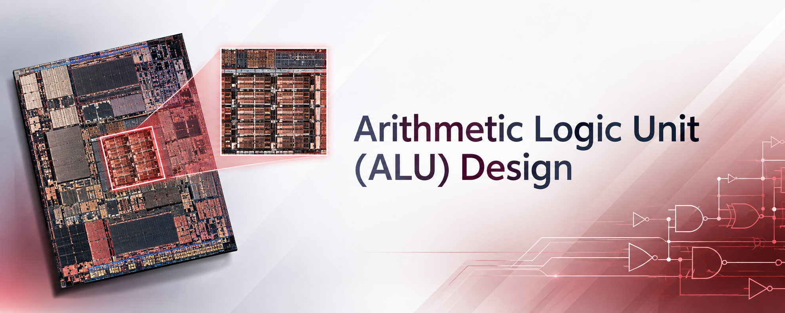

# Design and Implementation of ALU

- homework for the course "Design and Implementation of Arithmetic Logic Unit" in NSYSU, Taiwan
- TSMC N16 ADFP by TSRI was used for synthesis (Disclaimer: In accordance with the NDA with TSRI ADFP, the netlist and related synthesis artifacts have been excluded from this repository. Only are the synthesis results demonstrated here.)

## Homework

 Hw | Description
--------|:-----
[Hw1][1]| FXP FLP add mul

[1]: hw/HW1/

