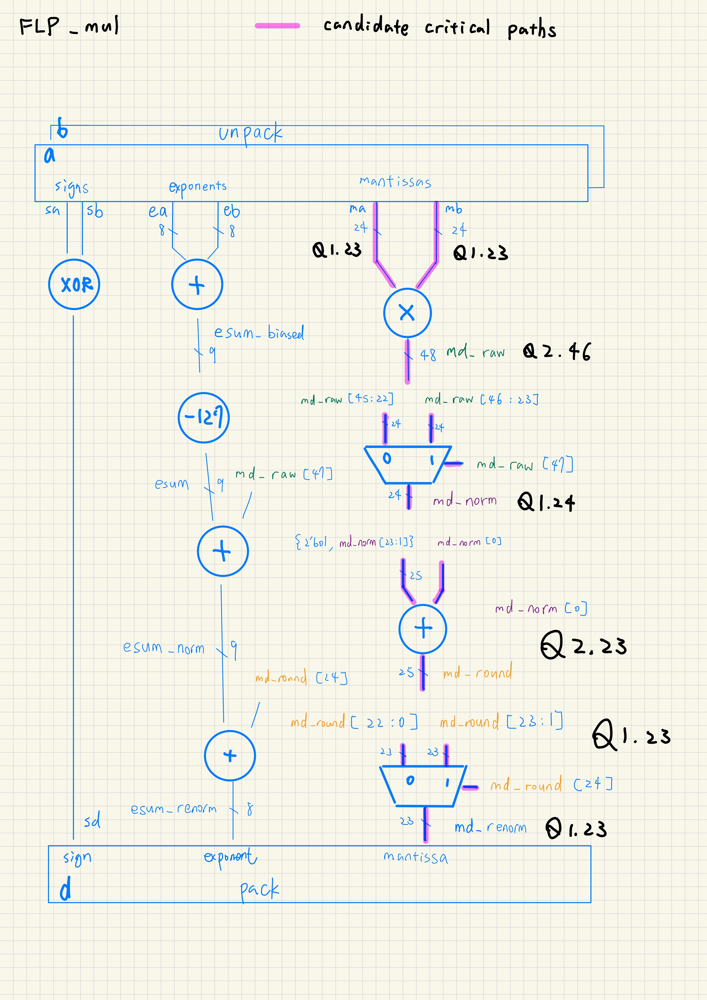
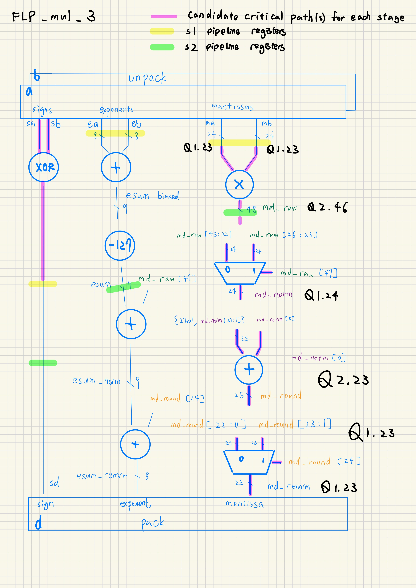
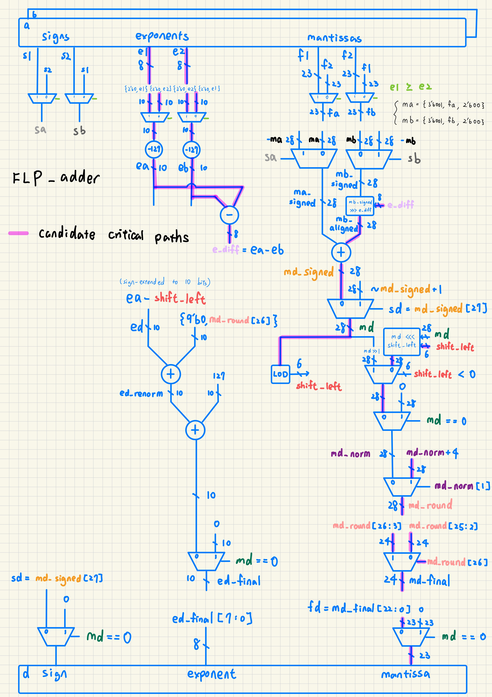
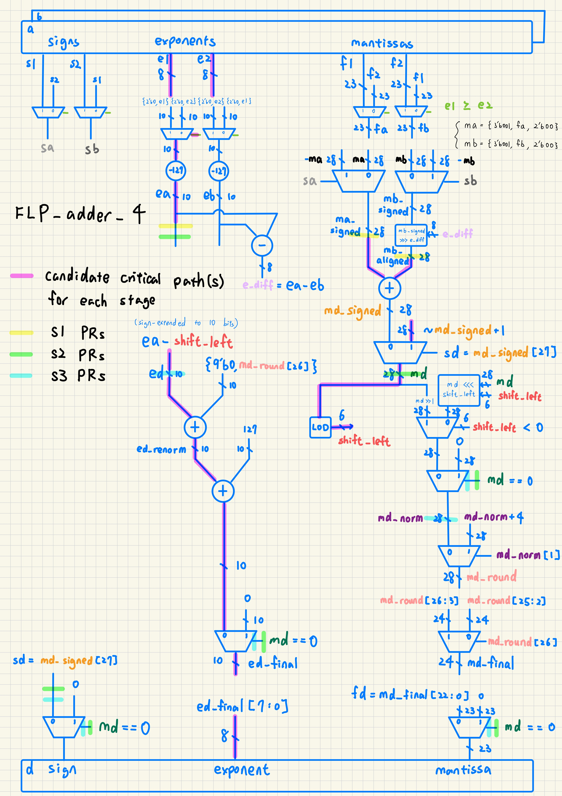
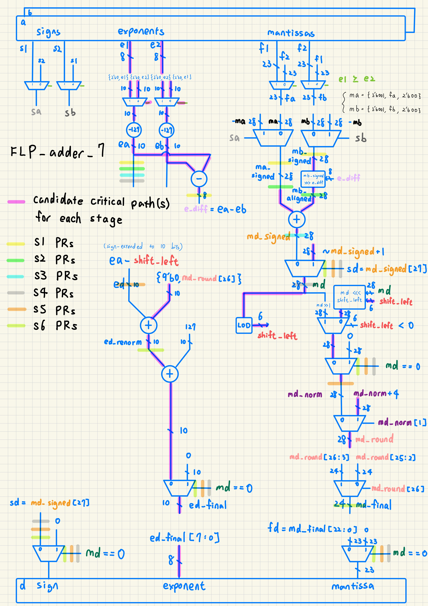

# Hw1. FXP FLP add mul

## 1. Introduction

In ALU Hw1, signed fixed-point (FXP) addition and multiplication and single-precision floating-point (FLP) addition and multiplication were implemented. Both combinational and pipelined FLP designs were developed, including a three-stage multiplier, a four-stage adder, and a seven-stage adder. Round-to-nearest was used, with halfway magnitudes rounded upward. IEEE 754 special numbers (infinities, NaNs, and subnormal) operands, were not considered within the Hw1 scope. Area, Delay, and Between synthesis configurations were compared using circuit area, delay, latency, and estimated power. The RTL was checked through pre-sim, and the synthesized netlists were checked through post-sim with SDF back-annotation.

## 2. Methodology

- **RTL organization:** Each pipelined design was implemented in a single top module rather than being split into separate stage modules.

- **Pipeline delay report:** `report_timing -from ... -to ...` was used instead of the TA's `-through` method. The first stage is measured from the data input ports to the first register bank's D pins; intermediate stages, from the previous bank's Q pins to the next bank's D pins; and the final stage, from the last bank's Q pins to the output ports. Mantissa, exponent, and sign paths are included within these boundaries. The `-through` option selects a complete path passing through a specified circuit object rather than isolating the delay inside that object. With explicit start and end boundaries, each stage can be reported without depending on stage module names or preserved hierarchy.

- **Reported delay:** Delay is reported as the time taken for data to propagate along the path selected by Design Compiler, from its input port or launching register to its output port or receiving register. This value is read from the `data arrival time` line in the timing report and converted to ns. Ideal clocks and zero external input/output delays are used, so the value includes logic and interconnect delays, plus clock-to-Q delay when the path starts at a register. It excludes the receiving register's setup time—the interval for which data must already be stable before the capturing clock edge. Therefore, reported delay describes data propagation, while a safe clock period must also allow for setup time. Timing slack is checked separately to determine whether that clock-period requirement is met.

- **Synthesis frequency tuning:** Slack is used to guide clock-period tuning and check whether each attempt meets its timing constraint. Separate netlists are selected by the Area and Delay searches, and the Between search is initialized at the midpoint of their selected periods. Successive synthesis attempts are performed until the selection meets the convergence criteria.

  The following excerpt from `tune()` in `scripts/workflow.py` shows the convergence check and next-period calculation. Here, `p` is the current period in ns, `slack` is the timing slack returned by synthesis, `floor` is the minimum period allowed by the search, and `quant()` rounds upward to the configured period resolution. The default resolution is 0.001 ns. Previously attempted periods are stored in `seen`; `low` and `high` are the largest relevant failing period and the smallest selected passing period, respectively.

  ```python
  slack = Decimal(str(result['metrics']['slack_ns']))
  passing = slack >= 0
  # Accept near-zero positive slack, or a passing Between result at its minimum.
  if passing and (slack <= args.tolerance or
                  (opt == 'Between' and p == quant(floor))):
      candidate = result
      converged = True
      break

  # Find the observed failing/passing bounds around the current best selection.
  failed = [Decimal(m['period_ns']) for m in old + [result]
            if m['metrics']['slack_ns'] < 0 and
            (candidate is None or
             Decimal(m['period_ns']) < Decimal(candidate['period_ns']))]
  low = max(failed, default=None)
  high = Decimal(candidate['period_ns']) if candidate else None
  # Stop when the interval is no wider than one period-resolution step.
  if low is not None and high is not None and high - low <= args.resolution:
      converged = True
      break

  # Estimate the next constraint from this netlist's slack; synthesis may change it.
  nxt = max(floor, p - slack)
  if low is not None and high is not None:
      if not low < nxt < high or quant(nxt) in seen or quant(nxt) == p:
          # Fall back to the midpoint for an out-of-bounds or repeated estimate.
          nxt = (low + high) / 2
  nxt = quant(nxt)
  if nxt in seen or nxt == p:
      # Move one step if rounding would otherwise repeat a tested period.
      nxt = p + args.resolution if not passing else max(quant(floor), p - args.resolution)
  ```

  A positive slack reduces the proposed period, while a negative slack increases it. For example, a 10 ns period with 8 ns slack proposes 2 ns for the next synthesis attempt. If this proposal falls outside the known failing/passing interval or repeats an attempt, the interval midpoint is used. A passing result is accepted when its slack is within tolerance, when Between meets its lower bound, or when the failing/passing interval is no wider than the period resolution.

  The calculation `p - slack` is used to propose a new synthesis constraint; the reported circuit delay is still obtained from `data arrival time`. This proposal is only an estimate based on the current implementation: different logic may be produced during the next synthesis because timing, area, and power are optimized together. Additional trials at nearby periods could improve confidence in the selected result, at the cost of increased synthesis runtime.

- **Automation:** Pre-sim, synthesis, post-sim, and result collection are performed through scripts. Pre-sim is run once per design, and each selected netlist is run through post-sim with its matching SDF file. Full tool output is retained in individual logs and `scripts/run.log`; selected measurements are collected into summary and pipeline CSV files.

```bash
bash scripts/run.sh all all --jobs 32
```

## 3. Design

### 3.1 FXP add & mul

The FXP adder was implemented using two signed 32-bit operands and a signed 33-bit output. Both operands are sign-extended before addition so that the carry and sign information of the full sum are preserved. The FXP multiplier uses two signed 32-bit operands and produces a signed 64-bit product. Both designs are fully combinational and provide the fixed-point baseline for comparison with the floating-point circuits.

### 3.2 FLP mul

#### 3.2.1 Combinational



The operands are unpacked into their signs, biased exponents, and significands. For normalized operands, the implicit leading one is restored to form two 24-bit Q1.23 significands. Their unsigned multiplication produces a full 48-bit Q2.46 product. The output sign is obtained by XORing the input signs, and the exponent is initially calculated as the sum of the biased input exponents minus 127. The product is then normalized, rounded, and renormalized before packing.

1. **Normalization:** Each input significand lies in the range [1, 2), so their product lies in [1, 4). A product of two or greater is shifted right by one, and the exponent is incremented to preserve its value. Otherwise, no shift is needed. After normalization, the significand lies in [1, 2) and is retained as Q1.24 for rounding. Its leading one is kept implicit, so only 24 bits are stored: the output fraction and one guard bit.

2. **Rounding:** Round-to-nearest requires information beyond the final Q1.23 significand; simply discarding all lower bits would truncate the result. The guard bit indicates whether the discarded part is at least half of one step between representable significands. If it is zero, the retained value is unchanged; if it is one, the retained significand is incremented. Under the homework's halfway-up rule, exact halfway cases are also rounded toward the larger magnitude. The leading one is restored for this addition, and a further bit is reserved for carry, giving a 25-bit Q2.23 result. The guard bit is used to decide the increment and is not retained in the output.

3. **Renormalization:** Rounding can change a significand just below two into exactly two. In that case, the rounded significand is shifted right once and the exponent is incremented again, restoring the normalized range [1, 2). This second normalization is needed because the first normalization occurs before rounding and cannot account for a carry created by the rounding addition. Finally, the implicit leading one is omitted, and the sign, eight-bit exponent, and 23 fraction bits are packed into the 32-bit output.

The full 48-bit product is required to preserve the multiplication result before normalization; the additional guard and carry bits are retained specifically to support rounding correctly. Following the homework simplification, the lower eight exponent bits are packed without overflow checking.

#### 3.2.2 Pipeline 3



Multiplication is divided into three stages:

1. Unpack the operands and compute the output sign.
2. Multiply the significands and calculate the initial output exponent.
3. Normalize, round, renormalize if necessary, and pack the output.

There are two internal register banks, with a combinational final stage, matching the TA checker schedule. The first bank stores `s1_ma`, `s1_mb`, `s1_ea`, `s1_eb`, and `s1_sd`. The second stores `s2_md_raw`, `s2_esum`, and `s2_sd`.

The sign and exponent information is registered along with the significand so that every output field belongs to the same input pair. These alignment registers are necessary even when the sign path is short: without them, a product from an earlier input could be packed with the sign or exponent of a later input. After the pipeline fills, a new multiplication can be accepted every cycle.

### 3.3 FLP add

#### 3.3.1 Combinational



The input exponents are compared, and the sign, exponent, and fraction fields are swapped together so that the first operand has the larger exponent. The hidden leading one is restored, and two low guard bits are appended to form 28-bit Q3.25 operands. The arithmetic is then performed through the following steps:

1. **Sign-magnitude to two's complement:** Conversion is performed immediately after unpacking and before alignment. A positive significand is kept unchanged; a negative significand is negated in two's complement. Both addition and effective subtraction can then be performed by the same signed FXP adder, without a separate magnitude-subtraction circuit. Subtraction of the second floating-point operand is represented by reversing its sign before this conversion.

2. **Pre-shift for alignment:** The smaller-exponent significand is arithmetically right-shifted by the absolute exponent difference so that both operands have the same exponent before addition. After operand swapping, this difference is nonnegative. With Q3.25 precision, shifts up to 25 positions can still place the smaller operand's leading bit within the retained fractional field. For `|e_diff| > 25`, its magnitude falls below the least significant internal bit, so a large-shift bypass could be used under the homework's finite-precision approximation. The boundary at 25 should not be discarded automatically because a retained bit remains. The current RTL uses an arithmetic shift for every difference rather than an explicit bypass; large shifts of negative operands retain sign-extension bits. This cutoff is a precision-based simplification, not a general rule for fully correctly rounded IEEE 754 arithmetic.

3. **Two's complement back to sign-magnitude:** Conversion is performed immediately after signed addition and before normalization. The result sign is taken from the signed sum, and a negative sum is negated to obtain its unsigned magnitude. Normalization and rounding are then performed on this magnitude, while the sign is carried separately. Exact cancellation is detected and packed as positive zero.

4. **Near-path cancellation and full normalization:** When opposite-sign operands have equal or adjacent exponents, many leading bits can cancel. This is the near, or close, case, where the result may require a large left shift. For other cases—the far case—normalization requires at most a one-position shift. These cases are commonly separated in dual-path adders, but a single shared normalization circuit is used here. The near/far distinction explains why the full normalization shifter is needed; separate near and far datapaths were not implemented.

5. **Leading-zero detection (LZD):** The leading zeros of the unsigned Q3.25 result are counted to locate its first one. The normalization shift is calculated as `zero_count - 2`: a magnitude of at least two is shifted right once, an already normalized magnitude is unchanged, and a smaller nonzero magnitude is shifted left by the required amount. The exponent is decreased for a left shift and increased for a right shift so that the represented value is preserved. This full LZD-and-shift operation handles cancellation as well as ordinary addition.

6. **Rounding and packing:** The normalized magnitude is rounded to Q1.23 using the guard bit. If rounding creates a carry into the next integer position, the result is shifted right once and the exponent is incremented. The exponent bias is restored, and the sign, lower eight exponent bits, and 23 fraction bits are packed. Exponent wrapping and normalized operands are used under the homework scope.

#### 3.3.2 Pipeline 4



The adder operations are grouped into four stages:

1. Unpack, convert to two's complement, and align the operands.
2. Perform signed FXP addition and convert the result to sign-magnitude.
3. Normalize the magnitude and adjust the exponent.
4. Round, renormalize if necessary, and pack the output.

These stages are separated by three internal register banks. The signed aligned operands and `ea` are stored in the first bank. The magnitude, sign, exponent, and exact-zero flag are stored in the second. The normalized magnitude, adjusted exponent, sign, and zero flag are stored in the third. The sign and zero flag are forwarded through the remaining stages so that the correct transaction is used during output packing. The final stage is combinational, following the TA checker schedule.

#### 3.3.3 Pipeline 7



The adder is separated into seven stages:

1. Unpack and convert the operands to two's complement.
2. Align the smaller-exponent operand.
3. Perform signed FXP addition.
4. Convert the sum to sign-magnitude.
5. Normalize and adjust the exponent.
6. Round and renormalize if necessary.
7. Restore the exponent bias and pack the output.

These stages are separated by six internal register banks, and the final packing stage is combinational. The exponent difference `e_diff` is registered before alignment, and `ea` is carried forward until normalization. After sign-magnitude conversion, the result sign and zero flag are also forwarded. With this finer partition, the logic within each stage is reduced, but more sequential area is required than in the four-stage design. A new input pair can be accepted every cycle by both pipelines after filling.

## 4. Result and Observations

The latest complete-flow execution passed the pre-sim checks and all synthesis tasks. Post-sim passed except for `FLP_mul_3` `Delay` because of an SDF negative recovery/removal-limit diagnostic. 

### 4.1 Summary
![Area, delay, latency, and power summary][1]


1. **Area–delay tradeoff:** Lower delays were obtained under the Delay configuration at the cost of increased area. For example, the combinational FXP multiplier changes from 918.190 µm² and 1.9950 ns under Area to 1492.163 µm² and 0.3320 ns under Delay. Intermediate area and delay values were obtained under Between.

2. **Power tradeoff:** Higher estimated power was reported under Delay than under Area for every design. For the combinational FXP multiplier, total power increases from approximately 0.000552 W to 0.006368 W. These values were estimated under the synthesis tool's activity assumptions.

3. **Register overhead:** Additional sequential area was required by pipelining. The seven-stage adder has 263.140 µm² of sequential area, compared with 131.570 µm² for the four-stage adder. Under Delay, their summary delays are close—0.2452 and 0.2460 ns—so the extra stages provide little improvement in the reported delay while increasing register area and the reported latency.


### 4.2 Pipelining
![Per-stage pipeline delays and critical stages][2]


1. **Seven-stage adder:** The largest arrival time is reported in Stage 5 (normalization) under Area and Delay, at 0.9631 and 0.2461 ns, respectively. Under Between, Stage 6 (rounding/renormalization) has the largest arrival time, at 0.6051 ns.

2. **Four-stage adder:** The largest arrival time is reported in Stage 3 (normalization) under Area, Stage 4 (rounding/packing) under Delay, and Stage 1 (unpacking/alignment) under Between. Their respective delays are 0.9909, 0.2610, and 0.6165 ns. Under Delay, the four stages are relatively balanced, ranging from 0.2460 to 0.2610 ns.

3. **Three-stage multiplier:** Stage 2 (multiplication) dominates under Area and Between, at 1.8572 and 1.1122 ns. Under Delay, Stage 3 (normalization/rounding/packing) becomes the largest-delay stage at 0.3847 ns, slightly exceeding Stage 2 at 0.3713 ns. Stage 1 remains much shorter, at 0.0448 ns in all three configurations, showing that equal stage counts do not imply equal stage delays.

## 5. Conclusion

From the results, it was observed that PPA tradeoff is always present, and that adding pipeline stages does not guarantee a proportional improvement in performance. In particular, similar delays were obtained for the four-stage and seven-stage adders under the Delay configuration, despite the greater register area and reported latency of the seven-stage design. The per-stage results also showed that the bottleneck can move as synthesis constraints are tightened: multiplication dominated the three-stage multiplier under Area, whereas normalization and rounding became the largest-delay stage under Delay. Therefore, pipeline effectiveness depends on the balance of measured stage delays as well as the stage count. Finally, the unresolved SDF diagnostic demonstrated that successful synthesis alone is insufficient to establish successful post-sim verification.

Going forward, the best practice is to choose pipeline boundaries from measured stage timing rather than dividing the operation sequence into a fixed number of stages alone. Register overhead and the alignment of sign, exponent, and zero information should be considered alongside the delay reduction. A separate near/far adder architecture could also be evaluated to avoid placing both a full alignment shifter and a full normalization shifter on the same path.

[1]: images/summary_table.png
[2]: images/pipeline_table.png
